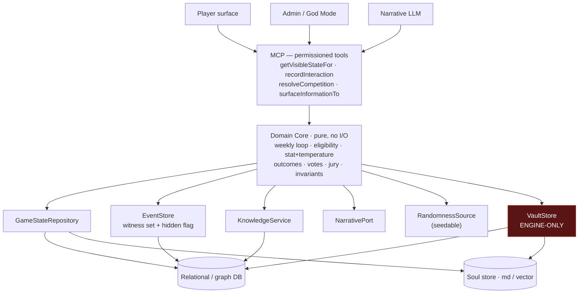

# Orwell — *Big Brother: The Simulation*

An immersive, serialized, single-player ***Big Brother*** simulation, rebuilt as a web
application. The system is game master, narrator, and the voice of every NPC houseguest:
it runs the weekly competition loop, simulates the full social life of the house —
including the off-screen scheming the player never witnesses — and renders it as a
first-person reality-TV experience.

This repository is the rebuild of a prior version that ran entirely inside a single LLM
chat. That approach worked but had structural failure modes (it leaked secrets, grew
sycophantic, and lost detail as its context window filled). The rebuild moves game state
into **external, permissioned stores** behind a **hexagonal architecture**, so the
deterministic rules, the secret state, and the narration are cleanly separated and
independently testable.

> **Status: design-complete, pre-implementation.** The design is fully specified (see
> [Documentation](#documentation)); no application code or stack exists yet. The next step
> is confirming the [open decisions](#open-decisions) — chiefly the tech stack — then
> building BDD/TDD-first. There is nothing to run today.

---

## Table of contents

- [What makes this hard](#what-makes-this-hard)
- [Design goals (the mandate)](#design-goals-the-mandate)
- [Architecture](#architecture)
- [Design decisions](#design-decisions)
- [Game mechanics](#game-mechanics)
- [Install & update](#install--update)
- [Testing philosophy](#testing-philosophy)
- [Repository layout](#repository-layout)
- [Roadmap](#roadmap)
- [Open decisions](#open-decisions)
- [Documentation](#documentation)
- [License](#license)

---

## What makes this hard

This is not primarily a rules engine — the *Big Brother* mechanics are the easy part. The
hard parts, and the reason for nearly every design decision below, are:

1. **Behavioral fidelity.** A real episode is drama, nuance, gossip, betrayal, showmance,
   and private strategy talks the cameras catch but you weren't in the room for. A
   mechanically-correct but behaviorally-*thin* simulation is a **failure**, not a partial
   success. Prior versions were too thin; raising fidelity is the #1 objective.
2. **Secrecy with integrity.** Like never seeing the producers' notes or other
   houseguests' confessionals, the player must **never** learn the hidden state — not
   through narration, dialogue, logs, or summaries. This has to hold *structurally*, not by
   politely asking a language model to keep quiet.
3. **No sycophancy.** A single chatbot tends to remember what you told it and bend the
   game to please you. Outcomes here must be earned, and NPCs must have their own agendas
   that create real friction.
4. **No degradation.** The prior version's secret store *thinned out* every time it was
   updated. Persisted detail must instead **accumulate and deepen** over a game.

---

## Design goals (the mandate)

These four priorities are non-negotiable and override convenience:

| Goal | What it means |
|---|---|
| **Behavioral fidelity first** | Reproduce the full social texture of the house, including off-screen NPC-to-NPC life. Tests assert *richness*, not just mechanics. |
| **The Vault Wall** | Secret state can never reach the player — enforced in code, and the admin/God Mode is walled from it too. |
| **Anti-sycophancy** | The deterministic core + seeded randomness decide outcomes; the LLM only narrates. Ground truth is queried, never "remembered" to appease. |
| **Non-degradation** | Persisted detail never regresses across saves and should deepen over time. |

---

## Architecture

The system is **hexagonal (ports & adapters)** with a **pure, dependency-free domain
core**. Everything with side effects — the database, the soul store, the LLM, the clock,
the player and admin surfaces — sits behind a port and is swappable.



**Ports (interfaces), at minimum:** `GameStateRepository`, `VaultStore` (engine-only),
`JournalStore`, `EventStore`, `KnowledgeService`, `NarrativePort` (the LLM),
`RandomnessSource` (seedable), `Clock`/`Scheduler`, `CharacterFactory`, `SoulProvider`.

**The permission boundary is the whole point.** Player-facing and admin-facing adapters and
tools depend only on the non-Vault ports; **nothing outward-facing imports `VaultStore`**.
The engine reads the Vault to *simulate* the house, but no outward tool can *return* its
contents. The Vault is rendered dark-red above to flag it as engine-only.

---

## Design decisions

Each decision records the **context**, the **decision**, and **why** — so the reasoning
survives even if the people don't.

### 1. Externalize state; the chat window is not the source of truth

- **Context.** The prior version held everything — rules, social graph, in-flight
  conversations, the secrecy rule itself — in one LLM context window. As it filled, it lost
  rules and state and started improvising.
- **Decision.** Persist every relevant dynamic (social graph, alliances, the full event
  record, per-entity knowledge, votes, competition history, evolving souls) in durable
  stores. Assemble only the **relevant slice** per agent call via queries (and optional
  vector retrieval).
- **Why.** Ground truth must outlive any single prompt and must not degrade under context
  pressure. Selective retrieval keeps each call focused and avoids the overload that
  caused the original failures.

### 2. Hexagonal architecture with a pure domain core

- **Decision.** The Game Bible becomes **code**: a dependency-free domain core implementing
  the weekly loop, eligibility/legality, stat-+-temperature competition resolution, votes,
  jury, and win conditions. All I/O lives behind ports.
- **Why.** A pure core is exhaustively unit-testable with a seeded random source and has no
  hidden state to leak. It lets us swap databases, soul storage, and even the LLM without
  touching the rules, and it keeps the rules immune to narrative pressure.

### 3. The Vault Wall is structural — and walls the admin too

- **Context.** The hidden "Producer's Vault" holds off-screen events, hidden attributes,
  and confessionals. The analog on the real show: you never see producers' notes or other
  houseguests' diary rooms.
- **Decision.** No Vault content — or any inference uniquely derived from it — may reach the
  player through **any** surface: narration, dialogue, system messages, logs, or
  end-of-session summaries (summaries may confirm only that an updated save exists).
  Enforcement is at the port/tool layer, never via prompt wording. **God Mode is walled
  from the Vault as well** — the administrator inspects non-Vault state only.
- **Why.** Prompt-based secrecy is exactly what failed before; a model cannot leak what it
  is never handed. And spoilers ruin the game above all else — the person running the
  project has never read the Vault and **must not be able to**, even as admin. Dev-time
  authoring of Vault schemas by an engineer is a separate concern from the running game,
  which surfaces Vault contents to no one.

### 4. Visibility is per-event metadata, not a function of storage

- **Context.** A prior bug logged interactions the player was *in the room for* as
  "off-screen/secret" simply because of where they were stored.
- **Decision.** There is **one** event record. Visibility is **metadata on each event** — a
  **witness set** plus a **hidden flag** — not a property of which store it lives in. If the
  player is in the witness set, the event is the player's knowledge (Journal-visible) and is
  *not* secret. The Vault holds **only genuinely off-screen** content.
- **Why.** Conflating "where it's stored" with "who may know it" is what produced
  mislabeled, leaky, or contradictory state. One record with explicit visibility makes both
  the Journal and Vault projections fall out correctly and testably.

### 5. Information reaches the player only through in-game pathways

- **Decision.** A hidden fact becomes known to the player **only** when an NPC tells them,
  they overhear it, they catch someone, etc. Propagation is an explicit, modeled event in
  `KnowledgeService`; until then the player has no access. NPCs likewise know only what they
  witnessed or were told — if there's no pathway, they don't *know* it (they may *suspect*).
- **Why.** This is how a player "learns the gossip" without breaking the Vault Wall:
  surfacing is a traceable in-game event, not a leak. It also gives the house genuine blind
  spots, which are part of the game.

### 6. Deterministic outcomes; the LLM only narrates (anti-sycophancy)

- **Decision.** The deterministic core plus a seeded random source decide *all* outcomes —
  competitions, votes, who-approaches-whom. The narrative layer **voices** the result; it
  never decides or bends it. The engine never protects or favors the player.
- **Why.** A model optimizing to please will erode stakes. Putting ground truth in the
  stores and having the narrator *query* it — rather than improvise to be agreeable —
  removes the mechanism by which sycophancy creeps in.

### 7. Per-moment temperature, not one global knob

- **Decision.** Each gameplay moment rolls a "temperature" across **all** involved variables
  (competition outcome, expression, whether an NPC takes initiative, which hidden element
  surfaces, alliance shifts, emotional volatility…). Temperature governs variance and
  surprise but **never** overrides hard rules (eligibility, the Vault Wall) or
  archetype-grounded outcome weighting. It is driven by the seedable `RandomnessSource`.
- **Why.** Per-variable variance is what makes a house feel alive and unpredictable without
  ever becoming arbitrary. Seeding makes that variance reproducible, so distributions can be
  property-tested across many runs.

### 8. Generated, deep, evolving characters; only the player is human-authored

- **Decision.** Only the **player's** profile is human-authored, at a first-run character
  creation (OOBE). **All NPC profiles are generated** by `CharacterFactory`, constrained to
  plausible *Big Brother* contestant archetypes. Each carries **many hidden elements**
  (motivations, fears, secrets, leanings); public persona may match or wildly diverge from
  them; hidden elements surface **rarely** (gated by the temperature roll); profiles
  **evolve** as the game proceeds.
- **Why.** Distinct, agenda-driven, deep characters are the engine of behavioral fidelity
  and a second defense against sycophancy. Rare surfacing keeps secrets dramatic instead of
  dumped. There is deliberately **no fixed protagonist** (see #12).

### 9. Hybrid persistence (relational + optional vector)

- **Decision.** Use a **queryable database** for relational/graph runtime state (social
  graph, alliances, votes, per-NPC knowledge, the event record) so context is retrieved as a
  slice. Store character **souls** as markdown and/or in a **vector** store for semantic
  personality similarity, behavioral memory, and conversation recall. Datasets have
  **distinct, code-enforced permissions**.
- **Why.** Relational queries make selective retrieval natural; a vector store fits the
  fuzzy "who is this character and what do they remember" problem. Keeping them separate with
  explicit permissions is what makes the Vault Wall enforceable per-dataset.

### 10. Detail must deepen, not degrade

- **Decision.** Persistence must never lose behavioral detail across saves/versions;
  generation must keep **enriching** characters, relationships, and history as the game
  proceeds. The Vault and Journal are versioned **together**. Tests assert non-degradation.
- **Why.** This directly reverses the prior version's worst regression, where every update
  thinned the secret store. It is both an architecture guarantee (durable external state)
  and a generation directive (deepen, don't thin).

### 11. MCP as the permissioned LLM ↔ engine boundary

- **Decision.** Expose engine capabilities to the narrative LLM through **MCP server(s)** as
  permissioned tools (e.g. `getVisibleStateFor(entity)`, `recordInteraction`,
  `resolveCompetition`, `surfaceInformationTo(player, fact, pathway)`). The model only ever
  receives what a tool returns.
- **Why.** A narrow tool surface is where the Vault Wall and anti-sycophancy rules are
  *physically* enforced: player- and admin-facing tools simply have no method that returns
  Vault data, and outcome tools return engine-decided results.

### 12. No fixed protagonist — replayable by design

- **Decision.** Every new game is a new save: a freshly created player character and a
  brand-new house of randomly-named NPCs, with no identity carried over. The legacy doc's
  named player and houseguests are an **illustrative example only**.
- **Why.** Replayability is a core product goal, and a hard-coded protagonist would
  undermine it. (This also keeps the test suite name-agnostic; see below.)

### 13. Bidirectional scenes

- **Decision.** Both the player and the NPCs initiate. NPCs hold goals from their profiles
  that make them seek the player out (for alliances, confrontations, reassurance, strategy),
  and the player can approach anyone. Neither side drives everything.
- **Why.** If the player were the only engine moving the social game, the house would feel
  inert and the fidelity mandate would fail.

---

## Game mechanics

The canonical rules the domain core implements:

- **Cast:** 16 houseguests (the player + 15 NPCs). **Jury of 9. Final 2.** Classic format
  with no core-structure twists (one or two production twists may be held in reserve and are
  never game-breaking).
- **A "week" = one HOH reign** — from an HOH competition to an eviction — not seven calendar
  days.
- **Weekly loop:** HOH competition → two nominations → veto competition → veto ceremony →
  eviction vote → live eviction → next HOH begins immediately.
- **Veto competition:** **six** players — the HOH, the two nominees, and **three by chip
  draw**. One chip is **"Houseguest's Choice"**: whoever draws it picks the sixth player
  instead of getting a random name (NPCs choose by soul motivation — their strongest available
  bond, an organic read from the relationship model, not a fixed label). The player can't
  influence which chips are drawn, but may hold Houseguest's Choice if they draw it.
- **Eligibility / legality (hard rules):** the **outgoing HOH cannot play** in the next HOH
  competition; the **veto winner cannot be named a replacement nominee**; everyone except the
  HOH and the two nominees votes at eviction (the HOH breaks ties).
- **Competition stats:** **Physical, Mental, Social** (no Luck stat). Outcomes weight the
  relevant stat against the competition type and apply **temperature** plus an **emotional
  modifier** sourced from the houseguest's soul (a rattled houseguest competes differently) —
  **never** story convenience. Emotional state is a *character/soul* attribute, not a fourth
  competition stat. The player may declare intent (compete / throw / play safe) beforehand and
  cannot change it after the result.
- **Daily-event invariant:** every in-game day contains at least one meaningful event
  (a competition, a nomination or veto ceremony, a vote or eviction, or a significant house
  event).
- **Jury & endgame:** the last nine evicted houseguests form the jury; jury management
  (how the player treats people on the way out) affects their votes; the Final 2 face a jury
  vote, ties broken by the final juror.

---

## Install & update

Orwell runs as **two co-located services in one container** — the TypeScript **engine** (MCP
server) and the **Orwell** front-end (Python) — wired over local MCP. On a Proxmox host, two
one-liners install and update it:

```bash
# install (run on the Proxmox host shell)
bash -c "$(curl -fsSL https://raw.githubusercontent.com/kevinhirsch/bbai/main/deploy/orwell.sh)"
# update
bash -c "$(curl -fsSL https://raw.githubusercontent.com/kevinhirsch/bbai/main/deploy/orwell-update.sh)"
```

The install creates a Debian LXC, installs Node 22 + Python, builds the engine (`npm run build`),
sets up the front-end, and starts both as systemd services. The save (SQLite + souls) lives at
`/opt/orwell/data` and is **preserved across updates**. The LLM provider (Ollama or an API key) and
ports are set in `/opt/orwell/data/.env`.

**Full guide** — install, configuration, manual / non-Proxmox install, updates, services, backups,
and troubleshooting: **[`docs/INSTALL.md`](docs/INSTALL.md)** (deploy internals + the engine
contract in [`deploy/README.md`](deploy/README.md)).

---

## Testing philosophy

Built **BDD/TDD-first**. The spec's invariants (`docs/bb-sim-spec.md` §12) become failing
`.feature` files first, implemented to green in this priority order:

> Vault isolation (incl. God Mode) → event visibility & propagation → behavioral fidelity →
> replayability/naming → competition eligibility → outcomes by stats+temperature →
> persistence non-degradation → daily-event.

Hard rules for the test suite:

- **No names in tests — roles only** (HOH, nominee, evictee, veto winner, NPC, player).
- **Sample saves are FORMAT ONLY** — their content is never canonical, seed, or test data
  (this includes the legacy example persona and names).
- A player-facing **or admin** path isn't "done" until a test proves it returns **no** Vault
  data.
- Tests must verify that off-screen NPC life **exists** and that witnessed events are **not**
  secret — i.e. behavioral *richness*, not just mechanical correctness.
- The domain core runs under fast unit tests with a **seeded** random source;
  randomness/temperature distributions and richness thresholds get **property-based** tests.

---

## Repository layout

```
.
├── CLAUDE.md                          # Operational guidance for Claude Code sessions
├── README.md                          # You are here
└── docs/
    ├── CLAUDE_CODE_INSTRUCTIONS.md    # Build brief & complete decision log (source of truth)
    ├── bb-sim-spec.md                 # v3 domain spec (concept, persistence, invariants)
    └── legacy/
        └── BB_GameBible.md            # Legacy chat-prompt version — migration reference only
```

Application code, a chosen stack, and build/test tooling do not exist yet and will be added
once the [open decisions](#open-decisions) are confirmed.

---

## Roadmap

Milestones (detail in `docs/CLAUDE_CODE_INSTRUCTIONS.md` §12):

| # | Milestone |
|---|---|
| M1 | Pure domain core (loop + eligibility + stat/temperature outcomes), unit-tested, no I/O |
| M2 | Ports + in-memory adapters; Vault **and** God-Mode isolation features green |
| M3 | `EventStore` + visibility model + `KnowledgeService` propagation; event-visibility green |
| M4 | Persistence adapters (DB + soul store) + selective retrieval + non-degradation tests |
| M5 | MCP tool boundary + narrative LLM integration (permissioned) |
| M6 | `CharacterFactory`: random house generation + player OOBE; replayability green |
| M7 | Off-screen simulation + bidirectional scheduler + per-moment temperature + evolving souls |
| M8 | God Mode / admin port + sandboxing; anti-sycophancy & behavioral-richness tuning |

---

## Open decisions

To confirm before building (full lists in `docs/CLAUDE_CODE_INSTRUCTIONS.md` §15 and
`docs/bb-sim-spec.md` §16):

1. **Tech stack** — Node/TS vs. Python; DB choice (SQLite → Postgres; a graph model for
   relationships?). *This gates everything else.*
2. **Soul/profile storage** — md, vector, or hybrid; the schema for deep hidden attributes
   and how evolution is persisted.
3. **Temperature model** — distributions, per-variable weighting, bounds, and the
   surfacing-rate for hidden elements.
4. **Vector approach** (if adopted) — embedding/store and what it indexes.
5. **Exact veto-draw participant rules, jury procedure, twists/specials.**
6. **Non-degradation test strategy** — how to operationalize "detail must accumulate."

---

## Documentation

- **`docs/CLAUDE_CODE_INSTRUCTIONS.md`** — the build brief and complete decision log; the
  primary source of truth.
- **`docs/bb-sim-spec.md`** — the v3 domain specification.
- **`docs/legacy/BB_GameBible.md`** — the legacy implementation, kept only as a migration
  reference. Its fixed player persona and houseguest names are illustrative and must never be
  hard-coded.
- **`CLAUDE.md`** — condensed operational guidance for Claude Code working in this repo.

The populated Producer's Vault, its internal structure, and any live secret save-state are
**intentionally excluded** from all documentation — preserving the Vault Wall is the point.

---

## License

[MIT](LICENSE) © 2026 kevinhirsch
