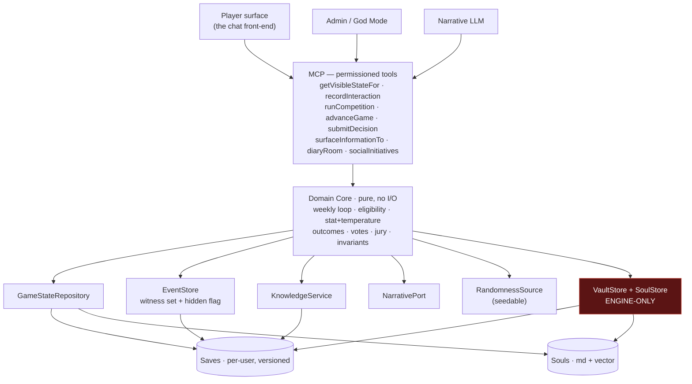

# Orwell — *Big Brother: The Simulation*

An immersive, serialized, single-player ***Big Brother*** simulation, played as a
conversation. The system is game master, narrator, and the voice of every NPC houseguest:
it runs the weekly competition loop, simulates the full social life of the house —
including the off-screen scheming the player never witnesses — and renders it as a
first-person reality-TV experience inside a chat.

This repository is the rebuild of a prior version that ran entirely inside a single LLM
chat. That approach proved the concept — **the conversation is the game** — but had four
structural failure modes: it leaked secrets, grew sycophantic, lost detail as its context
window filled, and every season felt the same. The rebuild moves game state into
**external, permissioned stores** behind a **hexagonal architecture** so the deterministic
rules, the secret state, and the narration are cleanly separated — and otherwise stays
deliberately out of the model's way (see
[ADR 0003](docs/decisions/0003-conversation-is-the-game.md)).

> **Status: built and playable.** The engine (TypeScript/Node 22) and the chat front-end
> (Python/FastAPI) are implemented BDD/TDD-first and run as two services over a
> permissioned MCP boundary. The drafted spec set is built and green **through 0074** — the
> eight priority invariants, the full gameplay loop, per-user sandboxes, durable persistence,
> the live off-screen society, the interactive finale, the character-evolution linchpin,
> deep character profiles, seasons-as-levels, in-game time & the nightly sleep economy,
> multi-device sync, public-internet exposure, and the metered token economy. *(The former rich-UI
> MVP-2 spec, **0022**, was removed in the 2026-06-28 PO review — superseded by 0020/0051/0054 under
> ADR 0003.)* Specs **0070–0073** (the Hermes-integration
> wave: off-screen texture, defensive hardening, the multi-platform gateway, and the structural
> game-build CI wall) and **0074** (local & tunable HTTPS, ADR 0014) are **built and green**. The reconciled per-feature
> index in [`docs/features/README.md`](docs/features/README.md) is authoritative for
> built-vs-deferred, and `npm test` is the live gate.

---

## Table of contents

- [What makes this hard](#what-makes-this-hard)
- [Design goals (the mandate)](#design-goals-the-mandate)
- [Architecture](#architecture)
- [Design decisions](#design-decisions)
- [Game mechanics](#game-mechanics)
- [Install & update](#install--update)
- [Developing](#developing)
- [Testing philosophy](#testing-philosophy)
- [Repository layout](#repository-layout)
- [Status & roadmap](#status--roadmap)
- [Open decisions](#open-decisions)
- [Documentation](#documentation)
- [License](#license)

---

## What makes this hard

This is not primarily a rules engine — the *Big Brother* mechanics are the easy part. The
hard parts, and the reason for nearly every design decision below, are:

1. **Behavioral fidelity.** A real episode is drama, nuance, gossip, betrayal, showmance,
   and private strategy talks the cameras catch but you weren't in the room for. A
   mechanically-correct but behaviorally-*thin* simulation is a **failure**, not a partial
   success. Prior versions were too thin; raising fidelity is the #1 objective.
2. **Secrecy with integrity.** Like never seeing the producers' notes or other
   houseguests' confessionals, the player must **never** learn the hidden state — not
   through narration, dialogue, logs, or summaries. This has to hold *structurally*, not by
   politely asking a language model to keep quiet.
3. **No sycophancy.** A single chatbot tends to remember what you told it and bend the
   game to please you. Outcomes here must be earned, and NPCs must have their own agendas
   that create real friction.
4. **No degradation.** The prior version's secret store *thinned out* every time it was
   updated. Persisted detail must instead **accumulate and deepen** over a game.

And one constraint that shapes how all four are solved: **the fix must not smother the
game.** The beta was fun *because* it was just a capable model improvising inside the
rules. The engine exists to repair the four failure modes above — leaks, sycophancy,
memory, sameness — and to otherwise hand the model the lightest possible context and get
out of its way.

---

## Design goals (the mandate)

These four priorities are non-negotiable and override convenience:

| Goal | What it means |
|---|---|
| **Behavioral fidelity first** | Reproduce the full social texture of the house, including off-screen NPC-to-NPC life. Tests assert *richness*, not just mechanics. |
| **The Vault Wall** | Secret state can never reach the player — enforced in code, and the admin/God Mode is walled from it too. |
| **Anti-sycophancy** | The deterministic core + seeded randomness decide outcomes; the LLM only narrates. Ground truth is queried, never "remembered" to appease. |
| **Non-degradation** | Persisted detail never regresses across saves and should deepen over time. |

Governing how they're honored: **the conversation is the game**
([ADR 0003](docs/decisions/0003-conversation-is-the-game.md)) — prefer removing context to
adding it; hand the model *facts to voice*, never *scripts to recite*; UI may augment the
chat but never replace an interaction that builds or progresses the game; lingering in a
room and just talking to people **is** play; people must make sense (one place at a time,
speech scoped to what each NPC legitimately knows); and each of these holds *testably*.

---

## Architecture

The system is **hexagonal (ports & adapters)** with a **pure, dependency-free domain
core**. Everything with side effects — persistence, the soul store, the LLM, the clock,
the player and admin surfaces — sits behind a port and is swappable.



**Ports (interfaces) include:** `GameStateRepository`, `VaultStore` (engine-only),
`JournalStore`, `EventStore`, `KnowledgeService`, `NarrativePort` (the LLM),
`RandomnessSource` (seedable), `Clock`/`Scheduler`, `CharacterFactory`, `SoulProvider`
(engine-only), and the outward `GameSession`/`EngineCommands` seam the tools cross.

**The permission boundary is the whole point.** Player-facing and admin-facing adapters and
tools depend only on the non-Vault ports; **nothing outward-facing imports `VaultStore`** —
proven structurally by a dependency-cruiser gate (type-only imports included), and proven
behaviorally by sentinel ("canary") tests on every tool output. The engine reads the Vault
to *simulate* the house, but no outward tool can *return* its contents. Each running game
is an isolated **per-user sandbox** (one active game per user, unlimited users, cross-user
isolation tested like the Vault).

As built: the engine lives in `src/` (domain core in `src/domain`, the live season loop and
social machinery in `src/engine`, ports/adapters/composition alongside); the player-facing
tier is the vendored chat front-end in `frontend/` (its own quarantined Python app), wired
to the engine over HTTP MCP.

---

## Design decisions

Each decision records the **context**, the **decision**, and **why** — so the reasoning
survives even if the people don't. (Formal, evolving records live in
[`docs/decisions/`](docs/decisions/).)

### 1. Externalize state; the chat window is not the source of truth

- **Context.** The prior version held everything — rules, social graph, in-flight
  conversations, the secrecy rule itself — in one LLM context window. As it filled, it lost
  rules and state and started improvising.
- **Decision.** Persist every relevant dynamic (social graph, alliances, the full event
  record, per-entity knowledge, votes, competition history, evolving souls) in durable
  stores. Assemble only the **relevant slice** per agent call via queries (and vector
  recall for souls).
- **Why.** Ground truth must outlive any single prompt and must not degrade under context
  pressure. Selective retrieval keeps each call focused and avoids the overload that
  caused the original failures.

### 2. Hexagonal architecture with a pure domain core

- **Decision.** The Game Bible becomes **code**: a dependency-free domain core implementing
  the weekly loop, eligibility/legality, stat-+-temperature competition resolution, votes,
  jury, and win conditions. All I/O lives behind ports.
- **Why.** A pure core is exhaustively unit-testable with a seeded random source and has no
  hidden state to leak. It lets us swap persistence, soul storage, and even the LLM without
  touching the rules, and it keeps the rules immune to narrative pressure.

### 3. The Vault Wall is structural — and walls the admin too

- **Context.** The hidden "Producer's Vault" holds off-screen events, hidden attributes,
  and confessionals. The analog on the real show: you never see producers' notes or other
  houseguests' diary rooms.
- **Decision.** No Vault content — or any inference uniquely derived from it — may reach the
  player through **any** surface: narration, dialogue, system messages, logs, or
  end-of-session summaries. Enforcement is at the port/tool layer, never via prompt
  wording. **God Mode is walled from the Vault as well** — the administrator inspects
  non-Vault state only.
- **Why.** Prompt-based secrecy is exactly what failed before; a model cannot leak what it
  is never handed. And spoilers ruin the game above all else — the person running the
  project has never read the Vault and **must not be able to**, even as admin.

### 4. Visibility is per-event metadata, not a function of storage

- **Context.** A prior bug logged interactions the player was *in the room for* as
  "off-screen/secret" simply because of where they were stored.
- **Decision.** There is **one** event record. Visibility is **metadata on each event** — a
  **witness set** plus a **hidden flag** — not a property of which store it lives in. If the
  player is in the witness set, the event is the player's knowledge (Journal-visible) and is
  *not* secret. The Vault holds **only genuinely off-screen** content.
- **Why.** Conflating "where it's stored" with "who may know it" is what produced
  mislabeled, leaky, or contradictory state. One record with explicit visibility makes both
  the Journal and Vault projections fall out correctly and testably.

### 5. Information reaches the player only through in-game pathways

- **Decision.** A hidden fact becomes known to the player **only** when an NPC tells them,
  they overhear it, they catch someone, etc. Propagation is an explicit, modeled event in
  `KnowledgeService`; until then the player has no access. NPCs likewise know only what they
  witnessed or were told — if there's no pathway, they don't *know* it (they may *suspect*).
  Hidden facts also diffuse NPC-to-NPC as **gossip**, drifting with each retelling.
- **Why.** This is how a player "learns the gossip" without breaking the Vault Wall:
  surfacing is a traceable in-game event, not a leak. It also gives the house genuine blind
  spots, which are part of the game.

### 6. Deterministic outcomes; the LLM only narrates (anti-sycophancy)

- **Decision.** The deterministic core plus a seeded random source decide *all* outcomes —
  competitions, votes, who-approaches-whom. The narrative layer **voices** the result; it
  never decides or bends it. The engine never protects or favors the player.
- **Why.** A model optimizing to please will erode stakes. Putting ground truth in the
  stores and having the narrator *query* it — rather than improvise to be agreeable —
  removes the mechanism by which sycophancy creeps in.

### 7. Per-moment temperature, not one global knob

- **Decision.** Each gameplay moment rolls a "temperature" across **all** involved variables
  (competition outcome, expression, whether an NPC takes initiative, which hidden element
  surfaces, alliance shifts, emotional volatility…). Temperature governs variance and
  surprise but **never** overrides hard rules (eligibility, the Vault Wall) or
  archetype-grounded outcome weighting. It is driven by the seedable `RandomnessSource`,
  with the numbers in one tunable constants module.
- **Why.** Per-variable variance is what makes a house feel alive and unpredictable without
  ever becoming arbitrary. Seeding makes that variance reproducible, so distributions can be
  property-tested across many runs.

### 8. Generated, deep, evolving characters; only the player is human-authored

- **Decision.** Only the **player's** profile is human-authored, at a first-run character
  creation (OOBE). **All NPC profiles are generated** by `CharacterFactory`, constrained to
  plausible *Big Brother* contestant archetypes. The stable baseline is the static
  **`CHARACTER`** (byte-stable for a whole game); everything that evolves — emotional state,
  memory, relationship beliefs — is the dynamic **`SOUL`** (markdown + vector, engine-only).
  Hidden elements surface **rarely** (gated by the temperature roll); a season genuinely
  *changes* a houseguest, entirely in the hidden layer.
- **Why.** Distinct, agenda-driven, deep characters are the engine of behavioral fidelity
  and a second defense against sycophancy. Rare surfacing keeps secrets dramatic instead of
  dumped. There is deliberately **no fixed protagonist** (see #12).

### 9. Hybrid persistence (relational + vector souls)

- **Decision.** Use queryable, versioned, per-user stores for runtime state (the event
  record, relationships, knowledge, saves) so context is retrieved as a slice. Store
  character **souls** as markdown plus an engine-only **vector** index for semantic recall
  ("the veto betrayal" recalls *that* memory, not the most recent chat). Datasets have
  **distinct, code-enforced permissions**.
- **Why.** Queries make selective retrieval natural; vector recall fits the fuzzy "who is
  this character and what do they remember" problem. Keeping them separate with explicit
  permissions is what makes the Vault Wall enforceable per-dataset.

### 10. Detail must deepen, not degrade

- **Decision.** Persistence must never lose behavioral detail across saves/versions;
  generation must keep **enriching** characters, relationships, and history as the game
  proceeds. The Vault and Journal are versioned **together**; saves are supersets with
  monotonic counts and lossless round-trips. Tests assert non-degradation, and a
  fail-closed integrity checkpoint refuses to persist a degraded or leaky state.
- **Why.** This directly reverses the prior version's worst regression, where every update
  thinned the secret store.

### 11. MCP as the permissioned LLM ↔ engine boundary

- **Decision.** Expose engine capabilities to the narrative LLM through an **MCP server** as
  permissioned, per-channel tools (e.g. `getVisibleStateFor`, `recordInteraction`,
  `runCompetition`, `advanceGame`/`submitDecision`, `surfaceInformationTo`). The model only
  ever receives what a tool returns, and binding decisions cross a single validated seam.
- **Why.** A narrow tool surface is where the Vault Wall and anti-sycophancy rules are
  *physically* enforced: player- and admin-facing tools simply have no method that returns
  Vault data, and outcome tools return engine-decided results.

### 12. No fixed protagonist — replayable by design

- **Decision.** Every new game is a new save: a freshly created player character and a
  brand-new house of generated, procedurally-named NPCs, with no identity carried over.
  Same seed reproduces the same house; new seed, new season.
- **Why.** Replayability is a core product goal — **every game should feel drastically
  different** — and a hard-coded protagonist would undermine it. (This also keeps the test
  suite name-agnostic; see below.)

### 13. Bidirectional scenes

- **Decision.** Both the player and the NPCs initiate. NPCs hold goals from their profiles
  that make them seek the player out (for alliances, confrontations, reassurance, strategy),
  and the player can approach anyone. Neither side drives everything — and the house keeps
  living **between the player's own turns** (one bounded off-screen tick per turn). The game
  clock is the player's play-clock: when the player steps away, the house suspends — it never
  schemes while the player can't react (the real-estate constraint cuts both ways).
- **Why.** If the player were the only engine moving the social game, the house would feel
  inert and the fidelity mandate would fail.

### 14. The conversation is the game ([ADR 0003](docs/decisions/0003-conversation-is-the-game.md))

- **Context.** The beta — the Game Bible + secrets + a small instruction set handed to an
  LLM — *played correctly*. The fun was already there, in conversation.
- **Decision.** The engine is a thin set of guardrails and a memory, not a director. Prefer
  removing context to adding it; hand the model **facts to voice**, never scripts to recite;
  UI may **augment** the chat (beat framing, a memory wall, a confirm step on binding
  actions) but never **replace** an interaction that builds or progresses the game.
  **Lingering is play**: the player can mill around any room, learn who's present and
  nearby, and talk to anyone — while those NPCs keep playing *their* game. **People must
  make sense**: one place at a time, speech scoped to what each NPC legitimately knows, a
  stable public persona. Each principle is enforced **structurally and testably** where
  possible.
- **Why.** Over-engineering the experience into mechanics and dashboards would kill the
  thing that made it work. The model stays creative; the stores stay true.

---

## Game mechanics

The canonical rules the domain core implements:

- **Cast:** 16 houseguests (the player + 15 NPCs). **Jury of 9. Final 2.** Classic format
  with no core-structure twists (one or two production twists may be held in reserve —
  Vault-sealed from player *and* admin until they fire — and are never game-breaking).
- **A "week" = one HOH reign** — from an HOH competition to an eviction — not seven calendar
  days.
- **Weekly loop:** HOH competition → two nominations → veto competition → veto ceremony →
  eviction vote → live eviction → next HOH begins immediately.
- **Veto competition:** **six** players — the HOH, the two nominees, and **three by chip
  draw**. One chip is **"Houseguest's Choice"**: whoever draws it picks the sixth player
  instead of getting a random name (NPCs choose by soul motivation — their strongest available
  bond, an organic read from the relationship model, not a fixed label). The player can't
  influence which chips are drawn, but may hold Houseguest's Choice if they draw it.
- **Eligibility / legality (hard rules):** the **outgoing HOH cannot play** in the next HOH
  competition; the **veto winner cannot be named a replacement nominee**; everyone except the
  HOH and the two nominees votes at eviction (the HOH breaks ties).
- **Competition stats:** **Physical, Mental, Social** (no Luck stat). Outcomes weight the
  relevant stat against the competition type and apply **temperature** plus an **emotional
  modifier** sourced from the houseguest's evolving soul (a rattled houseguest competes
  differently) — **never** story convenience. The player may declare intent (compete /
  throw / play safe) beforehand and cannot change it after the result.
- **Daily-event invariant:** every in-game day contains at least one meaningful event
  (a competition, a nomination or veto ceremony, a vote or eviction, or a significant house
  event).
- **Jury & endgame:** the last nine evicted houseguests form the jury; jury management
  (how the player treats people on the way out) genuinely affects their votes. The finale is
  staged live — statements, one question per juror, and an ordered vote reveal — with ties
  broken by the final juror.

---

## Install & update

Orwell runs as **two co-located services in one container** — the TypeScript **engine** (MCP
server) and the chat **front-end** (Python) — wired over local MCP, on a single Debian LXC on a
Proxmox host. The repo is **private**, so the first install authenticates **once** with a
fine-grained PAT (scope: this repo, *Contents: read-only*); the installer persists it under
`/opt/orwell/data/.env` and **every later command runs the local checkout** — no GitHub fetch, no
re-prompt.

**1 · Install** — run on the **Proxmox host** shell (the single authenticated moment):

```bash
export GIT_TOKEN=github_pat_xxx   # fine-grained (Contents: Read-only) OR classic (repo scope)
bash -c "$(curl -fsSL -H "Authorization: Bearer $GIT_TOKEN" -H "Accept: application/vnd.github.raw" "https://api.github.com/repos/kevinhirsch/orwell/contents/deploy/orwell.sh?ref=main")"
```

It creates the LXC (4 vCPU / 8 GB by default), installs Node 22 + Python, builds the engine,
starts both services, and persists the token + LLM config under `/opt/orwell/data` (preserved
across every update). Set the LLM provider — an API key or a local Ollama — in
`/opt/orwell/data/.env`.

**2 · Update** — from the host **or** inside the container; runs the local copy, never a script fetch:

```bash
bash /opt/orwell/deploy/orwell-update.sh
```

**3 · Control panel** — inside the container, one command wraps every operation below in a TUI menu:

```bash
orwell
```

**Maintenance** — each script is non-interactive (flags/env) for automation and shows a whiptail
dialog on a TTY. Run any of them from the host (it bridges into the LXC via `pct`) or inside it:

```bash
# Health: diagnose both tiers, restart whatever is unhealthy, verify
bash /opt/orwell/deploy/orwell-doctor.sh
```

```bash
# Back up the save (accounts, games, souls, .env) — then restore it
bash /opt/orwell/deploy/orwell-backup.sh
bash /opt/orwell/deploy/orwell-restore.sh
```

```bash
# NEW SEASON — clear every game; KEEP accounts / sessions / LLM config
bash /opt/orwell/deploy/orwell-game-reset.sh
```

```bash
# FACTORY RESET — back to first-run OOBE; preserves only data/.env
bash /opt/orwell/deploy/orwell-factory-reset.sh
```

```bash
# Rotate the deploy token (fine-grained PATs cap at one year)
bash /opt/orwell/deploy/orwell-update.sh --set-token
```

Save data under `/opt/orwell/data` is **preserved across updates**; only the factory reset scrubs
it. The login shell greets you with a live health panel that points at `orwell`.

**Full guide** — configuration, manual / non-Proxmox install, services, backups, and
troubleshooting: **[`docs/INSTALL.md`](docs/INSTALL.md)** (deploy internals in
[`deploy/README.md`](deploy/README.md)).

---

## Developing

The engine is TypeScript / Node 22; the front-end is its own quarantined Python app.

| Command | What it does |
|---|---|
| `npm install` | Install engine dev dependencies. |
| `npm test` | The full engine gate: typecheck → build → unit/property/architecture → BDD. |
| `npm start` | Run the built engine — the HTTP MCP server (`ORWELL_ENGINE_PORT`, default 8765). |
| `npm run test:unit` | Vitest (unit, property, and the dependency-cruiser Vault-boundary test). |
| `npm run test:bdd` | Cucumber.js over the implemented `.feature` specs. |
| `npm run test:arch` | The structural Vault-Wall gate (dependency-cruiser). |
| `cd frontend && python3 -m pytest tests/` | The front-end's own test gate (never touches the engine gate). |

Working in this repo? **Read [`CLAUDE.md`](CLAUDE.md) first** — it carries the operational
guidance (mandates, testing rules, hard "do-nots", environment variables, source layout)
and points at the live work queue.

---

## Testing philosophy

Built **BDD/TDD-first**. The spec's invariants became failing `.feature` files first,
implemented to green in strict priority order:

> Vault isolation (incl. God Mode) → event visibility & propagation → behavioral fidelity →
> replayability/naming → competition eligibility → outcomes by stats+temperature →
> persistence non-degradation → daily-event.

Hard rules for the test suite:

- **No names in tests — roles only** (HOH, nominee, evictee, veto winner, NPC, player).
- **Sample saves are FORMAT ONLY** — their content is never canonical, seed, or test data
  (this includes the legacy example persona and names).
- A player-facing **or admin** path isn't "done" until a test proves it returns **no** Vault
  data — structurally (dependency-cruiser) *and* behaviorally (sentinel canaries).
- Tests must verify that off-screen NPC life **exists** and that witnessed events are **not**
  secret — i.e. behavioral *richness*, not just mechanical correctness.
- The domain core runs under fast unit tests with a **seeded** random source;
  randomness/temperature distributions and richness thresholds get **property-based** tests.
- `cucumber.cjs` lists the BDD-gated features and is the canonical record of what's wired
  into the gate; `docs/features/README.md` is the per-feature status index.

---

## Repository layout

```
.
├── CLAUDE.md                   # Operational guidance for coding sessions — start here
├── README.md                   # You are here
├── cucumber.cjs                # The BDD gate — canonical list of green features
├── src/                        # The engine (TypeScript, hexagonal)
│   ├── domain/                 #   pure core: rules, eligibility, outcomes (no I/O)
│   ├── engine/                 #   season loop, relationships, souls, gossip, prompts
│   ├── ports/                  #   interfaces (VaultStore & co. are engine-only)
│   ├── adapters/               #   in-memory, persistence, MCP server, narrative, time
│   ├── services/ · surfaces/   #   outward-safe projections; player/admin/tools
│   └── composition/            #   roots, per-user sandbox registry, orchestrator, watcher
├── frontend/                   # The chat front-end (Python/FastAPI) — quarantined app
├── features/ · tests/          # BDD steps/support · unit/property/arch/integration/UAT
├── deploy/                     # One-liner install/update/factory-reset + systemd units
└── docs/
    ├── CLAUDE_CODE_INSTRUCTIONS.md   # Build brief & decision log (source of truth)
    ├── bb-sim-spec.md                # v3 domain spec (concept, persistence, invariants)
    ├── IMPLEMENTATION_QUEUE.md       # Live work queue — what's next, with prompts
    ├── features/                     # Numbered feature specs (design note + Gherkin)
    ├── decisions/                    # ADRs — incl. 0003 "the conversation is the game"
    ├── audits/                       # Product/experience audits + close-out ledger + open-items snapshot
    ├── INSTALL.md                    # Install/operate guide
    └── legacy/BB_GameBible.md        # Legacy chat-prompt version — reference only
```

---

## Status & roadmap

The original milestones **M1–M8** and the built spec set **0001–0074** are shipped — the eight
priority invariants, the MCP seam, the gameplay loop, per-user sandboxes, durable saves, the live
off-screen society, the endgame and interactive finale, the character-evolution linchpin (souls
evolve live and bend behavior), the born-deep deep-character profiles, the seasons-as-levels lane,
the casting diversity floor, multi-device sync, the LLM↔engine sync spine, in-game time & the
nightly sleep economy, public-internet exposure, and the metered token economy. **0022** (the rich
game UI / MVP-2) was **removed** in the 2026-06-28 PO review — by [ADR 0003](docs/decisions/0003-conversation-is-the-game.md)
the chat *is* the UI, and its goals shipped chat-forward via 0020/0051/0054. The newest specs **0070–0073** — the Hermes-integration wave (off-screen
texture enrichment, defensive hardening, the multi-platform messaging gateway, and a structural
game-build CI wall) — and **0074** (local & tunable HTTPS, [ADR 0014](docs/decisions/0014-local-and-tunable-https.md))
are **built and green**.

Live status is deliberately **not** duplicated in prose here (it drifts):

- **What's built:** the reconciled per-feature status index in
  [`docs/features/README.md`](docs/features/README.md) (cross-checked against the code, not the
  prose) + the BDD gate list in `cucumber.cjs`.
- **The authoritative open-items list:** the close-out ledger at the end of
  [`docs/audits/2026-06-10-full-product-audit.md`](docs/audits/2026-06-10-full-product-audit.md),
  with a source-verified, tier-organized snapshot (which tracker rows are stale; no
  launch-blockers remain) in
  [`docs/audits/2026-06-21-open-items-verification.md`](docs/audits/2026-06-21-open-items-verification.md).
- **Calibration:** **re-measured 2026-06-21 — primary goal MET.** The
  `JURY_WEIGHTS.gameRespect` 0.9→0.7 drop + live soul evolution flipped the old inversion (active
  wins ~20% vs passive ~7%); **do not lower it further** (it would over-correct a solved problem).
  Only an optional, low-priority reach-side lever remains
  ([`docs/audits/2026-06-21-session-observations.md`](docs/audits/2026-06-21-session-observations.md)).
- **Removed spec:** feature **0022** (the rich game UI / MVP-2) was cut in the 2026-06-28 PO review —
  per [ADR 0003](docs/decisions/0003-conversation-is-the-game.md) the chat *is* the UI, and its goals
  shipped chat-forward via 0020/0051/0054. There is no longer a deferred/parked MVP feature.

---

## Open decisions

The original open list (stack, datastore, soul storage, temperature model, veto/jury
procedure, non-degradation strategy, embedding provider) is **fully resolved** — see
[`docs/decisions/`](docs/decisions/) and the constants modules the features firmed up.
The last item, the **embedding provider** for semantic soul recall
([ADR 0004](docs/decisions/0004-embedding-provider.md)), is resolved **and built** (E86a,
2026-06-11): **fastembed (local ONNX)** is the runtime `EmbeddingProvider` — warmed at boot and
served through a worker-thread bridge — with the deterministic fake as the test adapter and the
whole-process fallback when the model is unavailable.

The decision log has since grown to **[ADRs 0001–0014](docs/decisions/)** — adding split-authority
by openness (0005), the in-game time/sleep economy (0006), public-internet exposure (0007),
cross-device chat consistency (0008), location single-source-of-truth (0009), token-economy
architecture (0010), concurrent engine-drive guardrails (0011), the two-window "Messenger mirror"
(0012), model-authored cast photos (0013), and local & tunable HTTPS (0014) — **all accepted and built**. Their residual open
items are tuning, owed verification runs, and post-launch refactor (`docs/REFACTOR-ROADMAP.md`), not
unbuilt architecture; the source-verified status is the
[open-items snapshot](docs/audits/2026-06-21-open-items-verification.md).

---

## Documentation

- **[`CLAUDE.md`](CLAUDE.md)** — condensed operational guidance for working in this repo;
  the best single orientation.
- **[`docs/CLAUDE_CODE_INSTRUCTIONS.md`](docs/CLAUDE_CODE_INSTRUCTIONS.md)** — the build
  brief and complete decision log.
- **[`docs/bb-sim-spec.md`](docs/bb-sim-spec.md)** — the v3 domain specification.
- **[`docs/features/`](docs/features/)** — the numbered feature specs (design note +
  executable Gherkin) with the live status index.
- **[`docs/decisions/`](docs/decisions/)** — ADRs, including
  [0003 "the conversation is the game"](docs/decisions/0003-conversation-is-the-game.md) and
  [0005 "split authority by openness"](docs/decisions/0005-split-authority-by-openness.md) (the
  engine records the open set of social play, never normalizes it — built in PR #355).
- **[`docs/IMPLEMENTATION_QUEUE.md`](docs/IMPLEMENTATION_QUEUE.md)** — the live work queue.
- **[`docs/audits/`](docs/audits/)** — the product and experience audits, the authoritative
  open-items **close-out ledger** (`2026-06-10-full-product-audit.md`), and the source-verified
  **open-items snapshot** (`2026-06-21-open-items-verification.md`).
- **[`docs/INSTALL.md`](docs/INSTALL.md)** — install and operations.
- **[`docs/legacy/BB_GameBible.md`](docs/legacy/BB_GameBible.md)** — the legacy
  implementation, kept as the canonical-mechanics reference. Its fixed player persona and
  houseguest names are illustrative and must never be hard-coded.

The populated Producer's Vault, its internal structure, and any live secret save-state are
**intentionally excluded** from all documentation — preserving the Vault Wall is the point.

---

## License

[MIT](LICENSE) © 2026 kevinhirsch
