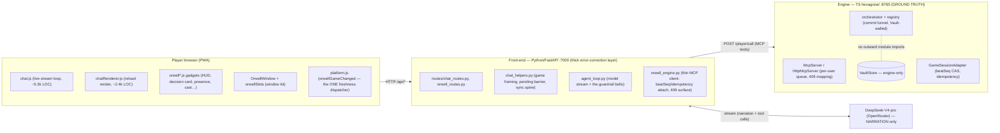

# ARCHITECTURE-AS-IS.md — Orwell, mapped for the pre-launch audit

**Status:** Phase 0.5 cartography for the 2026-06-21 pre-launch E2E audit. Synthesized from three
parallel read-only explorer passes (narration↔engine seam · realtime/consistency seam · FE
state/component tree), each tracing claims to `file:line`. This is the **as-is** map + a gap
analysis vs. the target; it feeds the bug audit (`AUDIT-LOG.md`) and the refactor roadmap
(`docs/REFACTOR-ROADMAP.md`, Phase 4). `[OBS]` = observed in source; `[INF]` = inferred.

## Container view (C4 level 2)

**The contract (ADR 0003 + 0005):** the engine owns every *closed-set* outcome (eligibility,
competition resolution, votes, persistence, the Vault); the LLM only *narrates* and may propose the
*shape* of open-set social consequence (direction/emphasis enums — magnitude stays engine-seeded).
The Vault Wall is **structural** (`registry.ts` `readsVault:false` is a literal type;
dependency-cruiser-enforced), never prompt-based.

---

## Seam 1 — Narration ↔ engine (the model-discipline layer)

**One player turn** `[OBS]`: FE chat POST → `build_chat_context` → `apply_game_framing`
(`chat_helpers.py:975`: one framing read `_fetch_game_state`, optional pre-resolve of an NPC
ceremony, the moment prompt, the pending barrier + delta line) → `stream_agent_loop`
(`agent_loop.py:2424`, reply/reasoning split) → tool calls via `orwell_engine._call` → `POST
/player/call` → `McpServer.callTool` → engine commit (`registry.ts:511 bumpBeatSeq`) → render.

**Model output config (confirmed):** the live game turn sends **no explicit `max_tokens`**
(`LLMConfig.DEFAULT_MAX_TOKENS=0`, preset `None` ⇒ the token field is omitted ⇒ the provider
default governs — `llm_core.py:1371-1373`); truncation risk on the main turn is therefore **low**.
**No `reasoning_effort`/`high`/`xhigh` knob is wired anywhere** in the FE — DeepSeek runs at its
default reasoning behavior; the FE only *consumes* reasoning deltas and must scrub them from the
public bubble. Internal extraction calls set small explicit caps (1200–1500) enlarged so a reasoning
model can think then emit tiny JSON.

**The guardrail family (the S3-CORE/B5/B6 fix set), what BINDS:**
- **Pending-decision barrier** (`chat_helpers.py:310`, applied `:1083`): a prompt directive blocking
  narration past an open *player* pending. **Soft-binds only** — it's appended text; the code comment
  (`:270`) admits the model can still narrate past it. Backstops are the beat-signature checkpoint
  (`:640`) + pre-emission guard (`:703`), both heuristic regex, fail-OPEN by ADR-0005 mandate.
- **Stall-nudge → forced-advance escalation (L39b)** (`agent_loop.py:1414/1470/3537`): text nudges
  escalate across turns; past the rungs the FE calls `advanceGame` ITSELF (`_commit_advance_silently`)
  with an F7 double-advance guard. **This is the structural backbone that BINDS forward progress.**
- **`_auto_record_scene` (0055)** (`agent_loop.py:1828`) + the coarser **E22 fallback**
  (`chat_helpers.py:1236`): **BIND the consequence fold** — the FE pulls `recordInteraction` itself
  when an engaged scene recorded nothing. Together "narrated but never recorded" is near-impossible.
- **`_auto_move_player`** (whereabouts persist), **createCharacter finalize fallback** (casting),
  **premiere `markHouseguestMet` belt** — each BINDS its lever, fires only where the model SKIPS.
- Every belt attaches the 0065 CAS token; a genuine stale-409 reconciles-and-skips.

**Smells:** (1) **forward-progress liveness is a FE guarantee, not the engine's** — the raw MCP `/rpc`
envelope gets none of these belts (the "game won't advance" failure mode is structurally FE-side).
(2) The pending barrier + desync backstops are heuristic/fail-open by deliberate choice → a
creatively-worded narrate-past-pending can slip until the next framing read re-grounds. (3) The
desync/stall state is process-local (`_LAST_BEAT_SEQ`, `_ADVANCE_STALL_LEVEL`, …) — soft FE state
riding a hard engine spine; a FE restart drops it (degrades gracefully).

---

## Seam 2 — Realtime / state-consistency (the concurrency / "garbage" surface)

**Three nested tiers**, strongest at the engine `[OBS]`:
- **A. Engine core — linearizable per user, isolated across users.** Per-user serialization queue
  (`HttpMcpServer.enqueue`), a monotonic **`beatSeq`** bumped once per committed mutation
  (`registry.ts:511`), compare-and-swap `guardBeatSeq(expected)` → typed `StaleBeatError` → **HTTP 409
  `{code:"stale-beat",beatSeq,board}`** before any write, rollback resets the register, at-most-once
  via `idempotencyKey` (LRU 32).
- **B. FE↔engine per-turn — causal, token-threaded.** FE holds last-seen `beatSeq` per user,
  attaches `expectedBeatSeq`+`idempotencyKey` on progression, refreshes from **every** response
  (`chat_helpers.py:426`), reconciles a 409 next-turn via a re-ground directive. A `stateDelta`
  feeds an O(Δ) "since your last turn" line.
- **C. Poll HUDs + cross-device push — eventual.** ONE debounced dispatcher
  `orwellGameChanged` (`platform.js:94`, ~250ms) is the only `orwell:gamechanged` source; status
  panel polls `/status` ~20s; cross-device `_publish_game_updated` (0064) is best-effort SSE over a
  polling floor — a lost push degrades latency (≤20s), never correctness (every event triggers a full
  re-read). Convergence: sub-second happy path, ≤1 poll worst case.

**Divergence surfaces / smells (static-traced, to confirm in State-3 concurrency runs):**
- **S5 [highest-value]** — the FE distinguishes a stale-beat 409 by **substring-matching the error
  message string** (`"stale write refused"`, regex `"(now N)"`, `chat_helpers.py:405/474`) and
  **discards the engine's structured `{code:"stale-beat",beatSeq,board}` body** (`orwell_engine.py`
  reads only `.error`). A wording drift silently turns reconcile into fail-closed.
- **S4/D2** — the `orwell:gamechanged` dispatch allowlist is a hand-coded tool-name array
  (`chat.js:2289`). A new mutating tool not added there mutates state but never refreshes HUDs (the
  documented FE-write-back silent-no-op family; `test_g15` only checks known seams).
- **S3** — a stale-409 on `recordInteraction`/`makeDeal`/`moveTo` is reconciled-and-**skipped**; if a
  social scene's only recording is dropped, that consequence fold is lost (non-degradation tension).
- **D5** — `/status` `pending` cache: present-`null` vs absent fallback is subtle/load-bearing (can
  re-surface a stale card if mis-handled). **D6/D7** — last-good roster (90s TTL) + status "stale dot"
  can show known-stale state during an engine blip (availability over consistency, by design).

---

## Seam 3 — FE state + component architecture (the player-tier client)

A **vendored generic chat workspace** with an **Orwell game layer bolted on** via `orwell*.js`,
gated by the server-injected `body[data-game-build]` (`app.py:822`).

- **State sharing = three mechanisms:** `window.*` globals (`window.chatModule`, `OrwellSlots`,
  `themeModule`, a swarm of `_orwell*` seams) with `&&` guards instead of imports; **custom events**
  (`orwell:gamechanged`, `orwell:pending`, …); **DOM dataset/body classes** (`data-game-build`,
  `data-user`, `ow-onboarding`, `ow-casting-headshot-open`).
- **Window kit:** one `OrwellWindow` class + `.ow-*` family + the `orwellSlots` anchor-slot engine
  (slot-not-coordinate placement, measured-height stacking, drag-offset persisted+clamped per
  user+game, one z-band 500–980, docked-into-rail mode). The S6-2/S11 collision/off-viewport fixes
  live here (`clampPos` fits-vs-bigger-than-viewport branch, the F2 drag-in-progress restack guard).
- **Chat render contract:** reply/reasoning split on the raw delta (`chat.js:1457` —
  `json.thinking?reasoning:reply`); body renders ONLY reply through `markdown.processWithThinking`
  (game-build scrub of operator-asides / `npc:<id>`); tool-beat chips + `orwellBeatOutcome` (Vault-free
  public outcomes) shared by both render paths; OOC `((...))` aside detector; decision card posts
  engine-direct with three re-arm paths.

**Smells:** (A) **duplicated render paths** — `chatRenderer.addMessage` (`:1898`, 517 LOC) is a second
render engine re-implementing live concerns; in-file comments document real live-vs-reload drift
regressions (the central FE smell). (B) decision cards don't survive reload through chatRenderer
(patched out-of-band by `rearmFromStatus`). (C) god-objects: `chat.js` 5.3k LOC (one ~2.9k-LOC SSE
loop), `chatRenderer.js` 2.4k LOC, `settings.js` 290KB, `slashCommands.js` 270KB. (D) season restart
driven from three modules through `window._orwell*` globals, not a shared controller. (E)
**`window.settingsModule` referenced (`orwellOnboarding.js:283`) but never assigned** — a silent
dead fallback. (F) **`body[data-user]` read everywhere for per-user storage keys with a `|| ""`
fallback** — if ever absent, every per-user key collapses to a shared empty namespace (a client-layer
per-user-isolation seam worth a guard; not the Vault).

### S1-1 overlap mechanism (traced) — the zero-data landing
`#welcome-screen` is an absolutely-positioned centered overlay (`top:40%`, `style.css:2001`) hidden
only by `.hidden{display:none}`; the casting/headshot cards are **separate** overlays over the same
region (`orwellHeadshot.js` window z:1000; onboarding scrim z:99999). They are **not structurally
mutually exclusive** — co-visibility is suppressed only by soft body classes that hide
`#welcome-tip`/`#welcome-sub` **but NOT `.welcome-name`**. **VIEWED 2026-06-21:** the zero-data
landing renders one clean "Welcome to the house" onboarding card (the mitigated state). **Latent
risk:** the structure still permits the welcome title to render behind a casting card when the
headshot window mounts mid-interview → **verify in State 2**.

---

## Gap analysis (target vs as-is) — candidate refactors (mechanism-tagged, for Phase 4)

| # | Target / fitness function | As-is gap (mechanism) | Sev |
|---|---|---|---|
| G1 | A stale-beat 409 reconciles on a **structured contract**, not prose | FE parses the error *string* and discards the engine's `{code:"stale-beat"}` body (S5) → wording drift = fail-closed | High (consistency) |
| G2 | Every mutating tool refreshes HUDs by construction | Manual `gamechanged` allowlist (S4/D2) → a new tool silently leaves HUDs stale | Med (latent) |
| G3 | One render path (live == reload) | Two hand-synced engines (chat.js vs chatRenderer.js) with documented drift | High (maintainability) |
| G4 | Welcome and onboarding/casting are **mutually exclusive by construction** | Separate overlays over one region; `.welcome-name` not suppressed (latent S1-1) | Med (latent) |
| G5 | No consequence fold is ever silently dropped | Stale-409 skip on `recordInteraction` can drop the only recording of a scene (S3) | Med (non-degradation) |
| G6 | Forward-progress liveness is an engine guarantee | Liveness lives entirely in FE belts; raw MCP gets none | Low (by ADR 0003, but flag) |
| G7 | Per-user client storage isolation is guaranteed | `data-user || ""` collapses to a shared namespace if absent | Low (isolation hygiene) |
| G8 | god-objects decomposed to testable seams | chat.js/chatRenderer.js/settings.js outliers; gating lattice (agent_loop.py:3395+) dense/untraced | Med (testability) |

Dependency direction is **correct** (engine imports nothing from FE; Vault structurally walled) — no
inversion found. The seam is well-architected; the gaps above are the leverage points.
